  <picture>
    <source media="(prefers-color-scheme: dark)"  srcset="./dark.svg">
    <source media="(prefers-color-scheme: light)" srcset="./light.svg">
    
  </picture>

<!-- EDIT 1: replace the LinkedIn URL below and in the Contact section -->

  <a href="https://shrisht.space"><b>Portfolio</b></a>
  &nbsp;&nbsp;·&nbsp;&nbsp;
  <a href="#featured-projects"><b>Projects</b></a>
  &nbsp;&nbsp;·&nbsp;&nbsp;
  <a href="https://www.linkedin.com/in/shrisht"><b>LinkedIn</b></a>
  &nbsp;&nbsp;·&nbsp;&nbsp;
  <a href="mailto:contact@shrisht.space"><b>Email</b></a>

 

---

## About

I'm Shrisht — an AI systems engineer and founder based in India, currently building
**Aether AI OS**.

I work on the unglamorous half of applied AI: the agent runtimes, edge APIs, evaluation
harnesses and data paths that decide whether a demo survives contact with real traffic.
The work spans AI operating systems, native browser engineering, agent platforms,
enterprise software and cloud infrastructure — different surfaces, one discipline: get
the foundations right, and everything above them stays cheap to change.

Bachelor of Computer Applications. Self-taught in everything that mattered.

 

---

## Currently Building

**Aether AI OS** — an AI-first personal operating system: agent runtime, long-term
memory, tool orchestration and voice, running local-first.

**AI Agent Platform** — the runtime beneath it. Durable execution, structured tool
contracts, and observability for agents that run longer than a single request.

**Enterprise Applications** — production systems for teams who need AI features that
hold up under audit, latency budgets and real users.

 

---

## Engineering Philosophy

**Systems, not scripts.**
Anything that runs twice earns a contract, a test and a rollback path.

**Ship to production.**
A prototype that never leaves localhost hasn't taught you anything about the problem yet.

**Latency is a feature.**
Compute belongs close to the user. The edge isn't an optimisation, it's the default.

**Types are the specification.**
Pydantic and TypeScript at every boundary. Validate at the edge of a system, never in
the middle of it.

**If you can't see it, you don't own it.**
Tracing, evals and structured logs ship with v1 — not after the first incident.

 

---

## Tech Stack

The working set. Chosen for production characteristics, not novelty.

<b>Languages &amp; Backend</b> — Python, TypeScript, FastAPI, Pydantic

 

- **Languages** — `Python` `TypeScript`
- **APIs** — `FastAPI` `Pydantic`

Pydantic models are the contract between services, agents and the database — one schema,
validated at the boundary, reused for OpenAPI and tool definitions.

<b>Frontend</b> — React, Next.js, Tailwind CSS

 

- **UI** — `React` `Next.js` `Tailwind CSS`

Server components by default, client state only where interaction demands it.

<b>Data &amp; Infrastructure</b> — PostgreSQL, Turso, Cloudflare Workers, Docker, Git

 

- **Data** — `PostgreSQL` `Turso`
- **Runtime** — `Cloudflare Workers` `Docker`
- **Tooling** — `Git`

PostgreSQL for relational truth, Turso for edge-replicated reads where round trips to a
single region would show up in the p99.

<b>AI &amp; Quality</b> — Claude, OpenAI, Gemini, Playwright

 

- **Models** — `Claude` `OpenAI` `Gemini`
- **Testing** — `Playwright`

Model-agnostic by design: prompts, tools and evals live behind an interface so swapping a
provider is a config change, not a rewrite.

 

---

## Featured Projects

### Aether AI OS

**An AI-first personal operating system.**

Private development

An agent runtime with long-term memory, tool orchestration and a voice interface, built
as one continuous system rather than a set of scripts. Local-first by architecture:
memory, embeddings and the base inference tier run on hardware I control, with cloud
models used deliberately rather than by default.

`Python` `FastAPI` `Pydantic` `PostgreSQL` `Qdrant` `Redis`

 

### Lumina

**A privacy-focused AI browser.**

In development · repository will be renamed to Lumina

A Chromium-based browser with AI built into the browsing experience rather than bolted
on as an extension. Brave/Chromium foundation, React WebUI, Rust services, telemetry
stripped out at the source.

`C++` `Chromium` `Rust` `React` `TypeScript`

[Repository](https://github.com/D0paX/aether-1.0)

 

### Portfolio

**Engineering portfolio and digital studio.**

Where the work lives: projects, writing, and the studio side of what I build.
Edge-rendered, typed end to end, and deliberately fast — no framework ceremony, no
layout shift, no cookie banner.

`Next.js` `TypeScript` `Tailwind CSS` `Cloudflare Workers`

[Live](https://shrisht.space)

 

### Enterprise Applications

**Production AI systems for teams that carry real risk.**

<!-- EDIT 4: name specific engagements or sectors if you're able to -->
Retrieval pipelines, agent workflows and internal tooling built to survive audit,
latency budgets and users who did not read the docs. Scoped, shipped and handed over.

`Python` `FastAPI` `PostgreSQL` `Docker` `Playwright`

 

---

## GitHub Analytics

  <picture>
    <source media="(prefers-color-scheme: dark)" srcset="https://github-readme-stats.vercel.app/api?username=D0paX&show_icons=true&include_all_commits=true&rank_icon=github&border_radius=12&bg_color=0F172A&title_color=22D3EE&icon_color=7C3AED&text_color=94A3B8&border_color=1E293B">
    <source media="(prefers-color-scheme: light)" srcset="https://github-readme-stats.vercel.app/api?username=D0paX&show_icons=true&include_all_commits=true&rank_icon=github&border_radius=12&bg_color=F8FAFC&title_color=2563EB&icon_color=06B6D4&text_color=475569&border_color=E2E8F0">
    
  </picture>
  <picture>
    <source media="(prefers-color-scheme: dark)" srcset="https://github-readme-stats.vercel.app/api/top-langs/?username=D0paX&layout=compact&langs_count=8&border_radius=12&bg_color=0F172A&title_color=22D3EE&text_color=94A3B8&border_color=1E293B">
    <source media="(prefers-color-scheme: light)" srcset="https://github-readme-stats.vercel.app/api/top-langs/?username=D0paX&layout=compact&langs_count=8&border_radius=12&bg_color=F8FAFC&title_color=2563EB&text_color=475569&border_color=E2E8F0">
    
  </picture>

<!--
  These cards come from github-readme-stats, a third-party service on Vercel.
  Colours are pinned to the banner palette. Two things worth knowing:
    · The service rate-limits and occasionally 502s — a broken card is its fault,
      not your markdown. Self-host it if that ever becomes annoying.
    · Private-repo commits only appear if you deploy your own instance with a token.
  Widths are fixed at 430px so the pair sits side by side on desktop and wraps to
  one column on a phone, instead of shrinking to unreadable thumbnails.
-->

 

---

## Contact

Open to conversations about AI infrastructure, agent systems and founding engineering
work. The fastest route is email.

<!-- EDIT 1: LinkedIn URL -->
- **Email** — [contact@shrisht.space](mailto:contact@shrisht.space)
- **Portfolio** — [shrisht.space](https://shrisht.space)
- **LinkedIn** — [linkedin.com/in/shrisht](https://www.linkedin.com/in/shrisht)
- **Location** — India, working across timezones

 

  Built with SVG and SMIL. No JavaScript, no external assets, no tracking.

